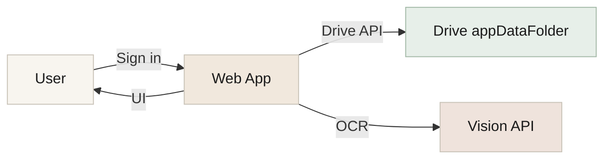
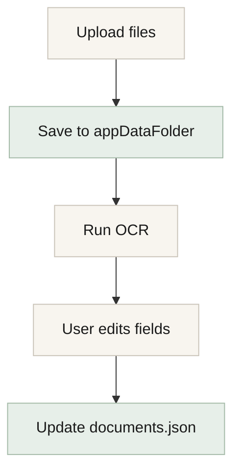
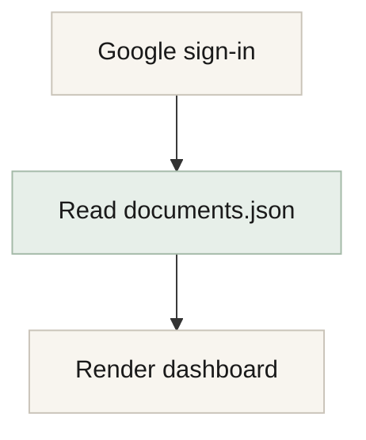

# Architecture & Technical Plan

This document outlines the system design, data model, and implementation plan for **HSA Paperless** with zero server-side storage of user documents or metadata.

## Goals
- End users only sign in with Google and start using the app.
- Document files and metadata are stored **only** in the user’s Google Drive `appDataFolder`.
- No server-side storage of documents or metadata.
- Fast dashboard load from a single metadata JSON file.
- Clean, modern UI with a dashboard + education tab.

## High-Level Architecture

- **Frontend**: Next.js (App Router), React, TypeScript
- **Auth**: Google OAuth (OpenID + Drive scope)
- **Storage**: Google Drive `appDataFolder`
- **Metadata**: `documents.json` stored in `appDataFolder`
- **OCR**: Google Cloud Vision API (one-time on upload)
- **Hosting**: Vercel

## User Data Flow
1. User signs in with Google.
2. App locates or initializes `documents.json` in the `appDataFolder`.
3. Dashboard renders from JSON metadata (no Drive scanning).
4. Document uploads are stored in `appDataFolder/documents/YYYY-MM/`.
5. OCR runs once at upload; extracted fields are saved to JSON.
6. Reimbursement changes update only JSON (and optionally file metadata).

## Google Drive Storage Model
**Hidden Google Drive folder (appDataFolder):**
- `documents/YYYY-MM/document_<timestamp>.<ext>`
- `documents.json`

**Why appDataFolder:**
- Hidden from the user’s main Drive view.
- Access restricted to this app only.

## Metadata Schema (documents.json)
```json
{
  "version": 1,
  "documents": [
    {
      "id": "doc_20260204_001",
      "fileId": "drive_file_id_here",
      "filename": "document_2026-02-04_001.jpg",
      "hasFile": true,
      "title": "CVS Prescription",
      "merchant": "CVS",
      "category": "Pharmacy",
      "date": "2026-02-04",
      "amount": 24.17,
      "notes": "",
      "reimbursed": false,
      "reimbursedDate": null,
      "createdAt": "2026-02-04T18:22:10Z",
      "ocrConfidence": 0.86
    }
  ]
}
```

**Rules**
- `hasFile=false` indicates manual entry without an attached document.
- `title` is editable and short; no amounts in title.
- `reimbursedDate` is optional and uses a date picker.

## OCR Extraction Strategy
- Triggered only on upload (never on login).
- Use Google Cloud Vision to extract:
  - Merchant
  - Date
  - Total amount
  - Category (best effort)
- User reviews and edits before saving.

## Search Strategy
Search matches these fields in memory:
- `title`, `merchant`, `category`, `notes`, `filename`

## Dashboard UX
**Tabs**
1. **Dashboard**
2. **HSA Education**

**Dashboard Panels**
- KPI cards: Total, Reimbursed, Not Reimbursed
- Chart: stacked bars (reimbursed vs not reimbursed)
  - Toggle: `Yearly` (default) / `Monthly`
  - Yearly: all years, no dropdown
  - Monthly: year dropdown
- Document table
  - Reimbursed toggle
  - View (center modal)
  - Download
  - Delete

## Chart Calculations
**Yearly view**
- Group by year
- Stacked bars: reimbursed vs not reimbursed totals

**Monthly view**
- Group by month within selected year
- Dropdown years range from earliest document year to current year

## UI Styling Notes
- Anthropic-inspired palette (warm off-white, muted accents)
- Premium typography pairing (serif heading + modern sans body)
- Centered document preview modal

## Security & Privacy
- Documents and metadata never stored on our servers.
- OAuth scopes limited to drive.appdata + basic profile/email.
- User can revoke access at any time.

## Implementation Phases
1. **Auth + Drive access**
   - Google OAuth
   - appDataFolder read/write
   - init `documents.json`

2. **Upload + OCR**
   - multi-file upload
   - OCR extraction
   - confirm/edit flow
   - write JSON

3. **Dashboard UI**
   - KPI cards
   - chart toggle + calculations
   - document table
   - preview modal

4. **Education Tab**
   - content layout
   - responsive typography

5. **Export + polish**
   - CSV export
   - error handling
   - loading states

## Open Questions (If Needed Later)
- CSV export format details
- Optional “reimbursed date” usage rules
- Future import of existing Drive documents

## Diagrams

### System Overview


### Upload + OCR Flow


### Login + Load Flow

