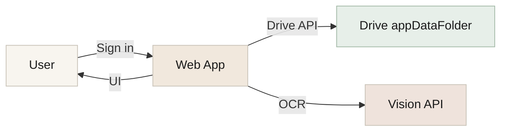
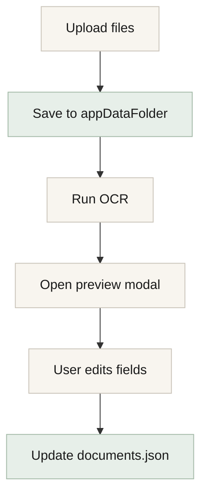
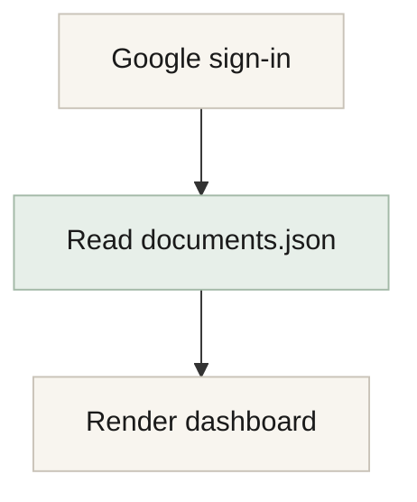

# Architecture & Technical Plan

This document outlines the system design, data model, and implementation plan for **HSA Paperless** with no separate server-side document/metadata database.

## Goals
- End users only sign in with Google and start using the app.
- Document files and metadata are stored **only** in the user's Google Drive `appDataFolder`.
- No separate server-side database for documents or metadata.
- Fast dashboard load from a single metadata JSON file.
- Clean, modern UI with dashboard and education tabs.

## High-Level Architecture

- **Frontend**: Next.js (App Router), React, TypeScript
- **Auth**: Google OAuth via NextAuth.js (OpenID + Drive scope)
- **Storage**: Google Drive `appDataFolder`
- **Metadata**: `documents.json` stored in `appDataFolder`
- **OCR**: Google Cloud Vision API (one-time on upload)
- **Hosting**: Vercel

## User Data Flow
1. User signs in with Google.
2. App locates or initializes `documents.json` in the `appDataFolder`.
3. Dashboard renders from JSON metadata (no Drive scanning).
4. Document uploads are stored in `appDataFolder/documents/YYYY-MM/`.
5. OCR runs once at upload; extracted fields are saved to JSON.
6. Reimbursement changes update only JSON.

## Google Drive Storage Model
**Hidden Google Drive folder (appDataFolder):**
- `documents/YYYY-MM/<original-filename>.<ext>`
- `documents.json`

**Why appDataFolder:**
- Hidden from the user's main Drive view.
- Access restricted to this app only.
- Included in user's storage quota.

## Metadata Schema (documents.json)
```json
{
  "version": 1,
  "documents": [
    {
      "id": "uuid-here",
      "fileId": "drive_file_id_here",
      "filename": "cvs-prescription.jpg",
      "hasFile": true,
      "user": "John",
      "title": "CVS Prescription",
      "category": "Pharmacy",
      "date": "2026-02-04",
      "amount": 24.17,
      "notes": "",
      "reimbursed": false,
      "reimbursedDate": null,
      "createdAt": "2026-02-04T18:22:10Z",
      "ocrConfidence": 0.86
    }
  ]
}
```

**Field Descriptions**
- `id`: UUID for the document entry
- `fileId`: Google Drive file ID (null for manual entries)
- `filename`: Stored filename in Drive
- `hasFile`: Whether a file is attached (false for manual entries)
- `user`: User/family member name (defaults to Google first name)
- `title`: Editable document title
- `category`: Medical category (Pharmacy, Dental, Vision, Medical, Lab/Test, Mental Health, Physical Therapy, Other)
- `date`: Date of service
- `amount`: Dollar amount
- `notes`: Optional notes
- `reimbursed`: Boolean toggle
- `reimbursedDate`: Optional date when reimbursed
- `createdAt`: ISO timestamp of creation
- `ocrConfidence`: Vision API confidence score (null if no OCR)

## OCR Extraction Strategy
- Triggered only on upload (never on login).
- Use Google Cloud Vision DOCUMENT_TEXT_DETECTION to extract:
  - Title (from first meaningful line)
  - Date (multiple format patterns with keyword priority)
  - Total amount (priority-based keyword matching)
  - Category (keyword matching)
- User reviews and edits in preview modal before saving.

## Search Strategy
Search matches these fields in memory:
- `title`, `user`, `category`, `notes`, `filename`

## Dashboard UX
**Three Tabs**
1. **Dashboard** - Document management
2. **About HSA** - HSA education content
3. **Q&A** - Dashboard help and common questions

**Dashboard Panels**
- Upload dropzone with drag-and-drop
- Manual entry button
- KPI cards: Total, Not Reimbursed, Reimbursed (with year/user filters)
- Document table with columns:
  - Title, User, Category, Date, Amount, Reimbursed, Actions, Notes
- Actions per row: View, Download, Delete
- Export options: CSV, ZIP of all files
- Clear All button

**Document Preview Modal**
- File preview (images with zoom controls, PDFs)
- Editable fields with dropdowns for User and Category
- Custom option for new users/categories
- Save Changes closes modal

## API Routes
- `GET /api/documents` - Load documents.json
- `PUT /api/documents` - Update documents.json (validates documents array)
- `POST /api/documents` - Create manual entry (server-generated id/createdAt)
- `PATCH /api/documents/[id]` - Update single document (write-locked)
- `DELETE /api/documents/[id]` - Delete document and file (write-locked)
- `POST /api/documents/upload` - Upload files with OCR (type + size validation, write-locked)
- `GET /api/documents/file/[id]` - Stream file for preview (safe MIME types only)
- `GET /api/documents/download/[id]` - Download file
- `GET /api/documents/export` - Download ZIP of all files

## UI Styling Notes
- Anthropic-inspired palette (warm off-white, muted accents)
- Premium typography pairing (serif heading + modern sans body)
- Centered document preview modal
- Rounded corners and soft shadows

## Concurrency & Write Safety
- All metadata writes go through `readModifyWriteDocuments` in `lib/drive.ts`, which acquires a per-user in-process write lock before the read-modify-write cycle.
- Token refresh uses a singleton promise guard to prevent concurrent refresh calls from racing.

## Upload Validation
- Server-side file type check: only JPEG, PNG, WebP, and PDF are accepted.
- Server-side file size limit: 10 MB per file.
- Document IDs and `createdAt` timestamps are always server-generated (not client-supplied).

## Security & Privacy
- Documents and metadata never stored on our servers.
- OAuth scopes limited to drive.appdata + basic profile/email.
- User can revoke access at any time.
- Files stored in hidden app data folder.
- File preview route restricts inline rendering to safe MIME types (images, PDF); unknown types force download.
- All file-serving routes include `X-Content-Type-Options: nosniff` to prevent MIME sniffing.
- `Content-Disposition` filenames are sanitized to strip quotes, newlines, and backslashes.
- Auth error detection covers both HTTP 401 and 403 from Google APIs.

## Implementation Status
- [x] Auth + Drive access
- [x] Upload + OCR
- [x] Dashboard UI with KPIs
- [x] Document table and preview
- [x] About HSA education tab
- [x] Q&A tab with dashboard info
- [x] Export CSV
- [x] Export ZIP
- [x] Clear All
- [x] User field with custom names
- [ ] Bulk edit
- [ ] Import existing Drive folder

## Diagrams

### System Overview


### Upload + OCR Flow


### Login + Load Flow

